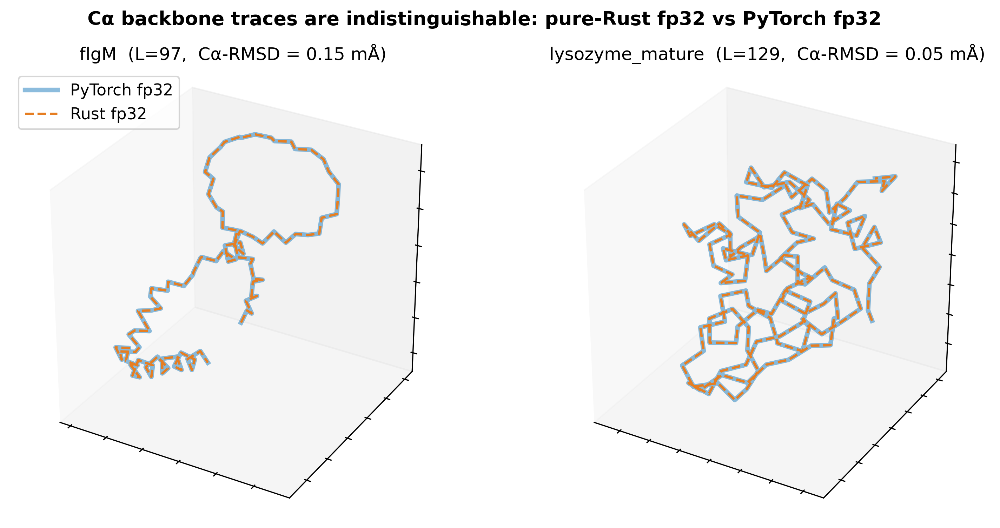

# Folding Everywhere v2

**Three protein models, one executable, no dependencies. Pure Rust, fp32, CPU —
predict a structure, design a sequence for it, or design a backbone from scratch.**

🔗 **[Project page](https://github.com/lingxusb/folding-everywhere)** · 👤 **[Author](https://lingxusb.github.io)**

> ### **[Download the Windows app (`gui.exe`)](https://github.com/lingxusb/folding-everywhere/raw/main/dist/windows-x86_64/gui.exe)**
> Clicking the link **downloads the `.exe` directly**. Double-click it: a local web page
> opens in your browser with three tabs. Model weights download automatically the first
> time each one is used.
>
> ### **[Download the macOS app (universal `gui`)](https://github.com/lingxusb/folding-everywhere/raw/main/dist/macos-universal/gui)**
> One **universal binary** for both Apple Silicon and Intel Macs. In Terminal:
> `xattr -dr com.apple.quarantine gui && chmod +x gui && ./gui`
> (the `xattr` step clears the Gatekeeper quarantine on the unsigned download).
>
> ### **[Download the Linux app (`gui`)](https://github.com/lingxusb/folding-everywhere/raw/main/dist/linux-x86_64/gui)**
> `chmod +x gui && ./gui`

---

Version 1 of this project ([Folding Everywhere](https://github.com/lingxusb/folding-everywhere))
ported **ESMFold v1 and ESMFold2** to dependency-free Rust. Version 2 adds **ProteinMPNN**
and **RFdiffusion2**, and puts all three behind a **single program** with a tab for each —
so one download covers the whole design loop:

```
       RFdiffusion2                 ProteinMPNN                    ESMFold
   motif + ligands  ──►  backbone  ──►  sequences  ──►  predicted structure  ──►  check
```

| Tab | Model | Direction | Weights | Typical run (4 CPU cores) |
|---|---|---|---|---|
| **ESMFold** | ESMFold1 (ESM-2 3B → trunk → IPA) | sequence → structure | ~8.4 GB, auto-downloaded | ~4.5 min for 76 aa |
| | ESMFold2 (ESM-C 6B → parcae trunk → diffusion) | sequence → structure | ~30 GB, auto-downloaded | ~1.5–6 min at 3 / 14 |
| **ProteinMPNN** | ProteinMPNN v_48_002/010/020/030 | structure → sequence | **compiled into the app** | ~7 s for 186 aa, 2 designs |
| **RFdiffusion2** | RFdiffusion2 (RFD_173) | motif + ligands → backbone | 1.34 GB, auto-downloaded | ~1.5 min at T = 2, ~70 min at T = 100 |

Every model is an independent from-scratch port validated against its PyTorch reference:

- **ESMFold1** — deterministic, ~0.0001 Å RMSD from PyTorch fp32 across 15 proteins.
- **ESMFold2** — bit-exact to a PyTorch fp32 run pinned at the same seed.
- **ProteinMPNN** — 160/160 designed sequences identical to PyTorch across 20 PDB structures.
- **RFdiffusion2** — 22/29 benchmark cases byte-identical to pinned PyTorch; 29/29 ligand
  atoms and CONECT records exact. In the other 7 the whole residual is one backbone carbonyl
  oxygen, at most **0.192 Å** — about a sixth of a C–C bond, far below any structural
  significance and far below the model's own inference noise. Why it is always that atom:
  [`rfdiffusion2/README.md`](rfdiffusion2/README.md#why-it-is-always-the-carbonyl-oxygen).

<p align="center"></p>
<p align="center"><sub>ESMFold1: Cα backbone traces, pure-Rust fp32 (blue) vs PyTorch fp32 (orange) — the same structure to fp32 round-off.</sub></p>

## Quick start

1. Download the app for your platform from [`dist/`](dist/) (links at the top) and run it.
2. Your browser opens at `http://127.0.0.1:<port>/`. Pick a tab.
3. Each tab has a **Load example** link, so you can see the whole thing work before
   supplying your own input.
4. Watch the live progress log, then download the result (PDB, or FASTA for ProteinMPNN).

Nothing is uploaded anywhere: the server listens on `127.0.0.1` only, and your browser is
just the front-end. Keep the console window open while using it; close it to quit.

**First run per model** downloads that model's weights (ProteinMPNN needs no download —
its four checkpoints are inside the executable). Weights are cached in `~/.esmfold`,
`~/.esmfold2` and `~/.rfdiffusion2` (`%USERPROFILE%\` on Windows) and re-used forever after.
See **[docs/GUI.md](docs/GUI.md)** for the full tour, the cache locations, the environment
overrides and the troubleshooting notes.

### Command line

A **CLI per model** ships alongside the app, prebuilt for the same three platforms in
[`dist/`](dist/) — `fold` (ESMFold1), `fold_standalone` (ESMFold2), `mpnn` (ProteinMPNN) and
`rfd2` (RFdiffusion2), with a `.exe` suffix on Windows. They take the same weights caches the
app fills, so nothing is downloaded twice.

```bash
fold --seq MQIFVKTLTGKTITLEV... -o out.pdb             # ESMFold1
fold_standalone MQIFVKTLTGKTITLEV... 0 out.npy 20 68  # ESMFold2 (positional: seq seed out loops steps)
mpnn --pdb backbone.pdb --num_seq_per_target 8        # ProteinMPNN
rfd2 --input-pdb motif.pdb --contigs '10,A106-106,10' # RFdiffusion2
```

Each model's README documents its own options, and every subtree has a
`docs/DEPLOYMENT.md` covering what ships and what it needs. To build them:

```bash
cargo build --release          # all CLIs plus the app
```

## Requirements

- **Windows 10+ / macOS / Linux** on an x86-64 CPU with AVX2 (any PC from ~2013 on), or an
  Apple Silicon Mac. `curl` — which all three ship — is used for weight downloads.
- **RAM:** ~10 GB for ESMFold1, ~25 GB for ESMFold2, ~2 GB for ProteinMPNN and RFdiffusion2.
- **Disk:** ~9 GB (ESMFold1) / ~30 GB (ESMFold2) / ~1.4 GB (RFdiffusion2) for cached weights.
- **No GPU, no Python, no PyTorch, no installer.**

## Repository layout

The repository keeps one **self-contained subtree per model** — each holds that model's Rust
crate(s), its PyTorch reference harness, its parity fixtures, its benchmark results and
figures, and its own detailed README — plus the shared app and the prebuilt binaries:

| Path | What's inside |
|---|---|
| [`gui/`](gui/) | **The app.** One `tiny_http` server, one page, three tabs; one Rust module per model. Builds to `gui` / `gui.exe`. |
| [`esmfold/`](esmfold/README.md) | **ESMFold 1 + 2** — the `esmfold1` and `esmfold2` crates, the PyTorch fp32 reference (`esmfold2_fp32/`), fixtures, results and figures. |
| [`proteinmpnn/`](proteinmpnn/README.md) | **ProteinMPNN** — the `mpnn` crate, the four embedded checkpoints (`weights/`), the reference harness, fixtures, results and figures. |
| [`rfdiffusion2/`](rfdiffusion2/README.md) | **RFdiffusion2** — the `rfd2` crate, the reference harness, fixtures, the 29-case benchmark (`bench/`), results and figures. |
| [`dist/`](dist/) | **Prebuilt binaries** — the `gui` app and the four model CLIs (`fold`, `fold_standalone`, `mpnn`, `rfd2`) for `linux-x86_64`, `windows-x86_64` and `macos-universal`, with [`dist/README.txt`](dist/README.txt). |
| [`docs/`](docs/) | [`GUI.md`](docs/GUI.md) (the app), [`BUILD.md`](docs/BUILD.md) (building and cross-compiling), [`CODE_STRUCTURE.md`](docs/CODE_STRUCTURE.md) (map of the repo). |
| `Cargo.toml` · `build_all.sh` | Rust workspace (`gui`, `esmfold/esmfold1`, `esmfold/esmfold2`, `proteinmpnn/mpnn`, `rfdiffusion2/rfd2`) and the three-platform release build. |

Each model's detailed documentation lives with it:

- **[`esmfold/README.md`](esmfold/README.md)** — the two ESMFold ports, the fp32-vs-bf16
  question, the accuracy tables, the config sweep. Deeper: [`esmfold/docs/`](esmfold/docs/).
- **[`proteinmpnn/README.md`](proteinmpnn/README.md)** — options, seeds, what "reproduces
  ProteinMPNN" means, speed. Deeper: [`proteinmpnn/docs/`](proteinmpnn/docs/).
- **[`rfdiffusion2/README.md`](rfdiffusion2/README.md)** — what "bit exact" means here and
  why f64-pinning is the route to it, the 29-case benchmark, the ligand-topology limitation.
  Deeper: [`rfdiffusion2/docs/`](rfdiffusion2/docs/).

## Building from source

```bash
cargo build --release --bin gui   # the app
./build_all.sh                    # Linux + Windows + macOS universal, into dist/
```

Build-time crates only: `memmap2`, `safetensors`, `half`, `bytemuck`, `rayon`,
`matrixmultiply`, `libm`, `serde_json`, `tiny_http`. No C dependencies. Cross-compiling
needs [`cargo-zigbuild`](https://github.com/rust-cross/cargo-zigbuild) and zig 0.11+; see
**[docs/BUILD.md](docs/BUILD.md)**.

## Acknowledgements

This project would not exist without the tremendous open-source efforts behind the three
models it re-implements. Meta AI's ESM team, EvolutionaryScale, Justas Dauparas and the
ProteinMPNN authors, and the Institute for Protein Design released not just papers but
working code, trained weights and reference implementations that anyone can read, run and
check against. Every parity number in this repository exists because those reference
implementations are public and reproducible. We are grateful for that openness, and for the years of work it
represents.

## References

This project re-implements the **inference path** of the following models. If you use it,
please cite the original papers.

**ESMFold / ESM-2**

- Z. Lin, H. Akin, R. Rao, B. Hie, Z. Zhu, W. Lu, N. Smetanin, R. Verkuil, O. Kabeli,
  Y. Shmueli, A. dos Santos Costa, M. Fazel-Zarandi, T. Sercu, S. Candido, A. Rives.
  *Evolutionary-scale prediction of atomic-level protein structure with a language model.*
  **Science** 379, 1123–1130 (2023).
  doi:[10.1126/science.ade2574](https://doi.org/10.1126/science.ade2574)
- A. Rives, J. Meier, T. Sercu, S. Goyal, Z. Lin, J. Liu, D. Guo, M. Ott, C. L. Zitnick,
  J. Ma, R. Fergus. *Biological structure and function emerge from scaling unsupervised
  learning to 250 million protein sequences.* **PNAS** 118(15):e2016239118 (2021).
  doi:[10.1073/pnas.2016239118](https://doi.org/10.1073/pnas.2016239118)
- Code: <https://github.com/facebookresearch/esm> · Weights:
  <https://huggingface.co/facebook/esmfold_v1>

**ESMFold2 additionally builds on**

- EvolutionaryScale. *ESM Cambrian: a family of protein language models* (2024).
  <https://www.evolutionaryscale.ai/> · Weights: <https://huggingface.co/biohub/ESMC-6B> ·
  ESMFold2: <https://huggingface.co/biohub/ESMFold2>

**ProteinMPNN**

- J. Dauparas, I. Anishchenko, N. Bennett, H. Bai, R. J. Ragotte, L. F. Milles,
  B. I. M. Wicky, A. Courbet, R. J. de Haas, N. Bethel, et al. *Robust deep learning-based
  protein sequence design using ProteinMPNN.* **Science** 378, 49–56 (2022).
  doi:[10.1126/science.add2187](https://doi.org/10.1126/science.add2187)
- Code and weights: <https://github.com/dauparas/ProteinMPNN>

**RFdiffusion2**

- W. Ahern, J. Yim, D. Tischer, S. Salike, S. M. Woodbury, D. Kim, I. Kalvet, Y. Kipnis,
  B. Coventry, H. R. Altae-Tran, et al. *Atom level enzyme active site scaffolding using
  RFdiffusion2.* **bioRxiv** (2025).
  doi:[10.1101/2025.04.09.648075](https://doi.org/10.1101/2025.04.09.648075)
- Code: <https://github.com/RosettaCommons/RFdiffusion2> · Weights:
  <https://files.ipd.uw.edu/pub/rfdiffusion2/model_weights/>

## Citation

Please cite the original model papers above. You may additionally reference this
re-implementation:

```bibtex
@software{folding_everywhere,
  author = {Shao, Bin},
  title  = {Folding Everywhere: pure-Rust fp32 re-implementations of ESMFold, ProteinMPNN and RFdiffusion2},
  url    = {https://github.com/lingxusb/folding-everywhere},
  year   = {2026}
}
```

## License & disclaimer

Code: MIT (see [LICENSE](LICENSE)).

The **model weights** belong to their authors under their own licenses and are not this
project's work. ESM-2 / ESMFold / ESM-C weights are © Meta AI / EvolutionaryScale and are
downloaded at runtime from Hugging Face. The RFdiffusion2 checkpoint is © the Institute for
Protein Design and is downloaded at runtime from `files.ipd.uw.edu`. The four ProteinMPNN
checkpoints are © Justas Dauparas and co-authors, redistributed here under the upstream
repository's MIT license.

These are independent re-implementations of the inference path only — no training code and
no new weights — and are not affiliated with or endorsed by any of the original authors.
Predictions and designs are computational hypotheses and should be validated
experimentally.
