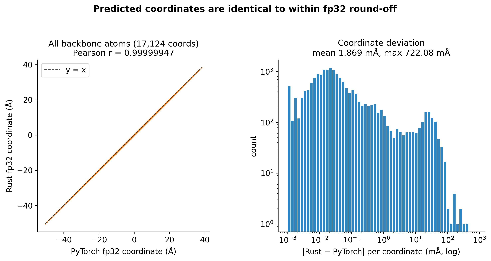
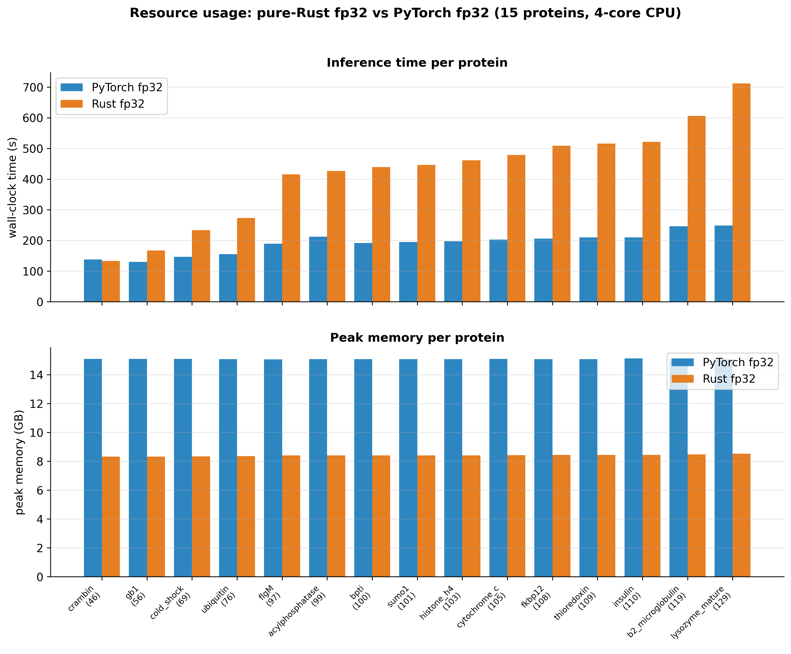

# Folding Everywhere

**A pure-Rust, fp32, dependency-free re-implementation of ESMFold v1 *and* ESMFold2 — fold proteins on any computer from a single executable.**

🔗 **[Project page](https://github.com/lingxusb/folding-everywhere)** · 👤 **[Author](https://lingxusb.github.io)**

> ### 👉 **[Download the Windows app (fold_gui.exe)](https://github.com/lingxusb/folding-everywhere/raw/main/dist/fold_gui.exe)**
> Clicking the link **downloads the `.exe` directly**. Then double-click it, paste a
> protein sequence, and get a 3D structure. The first launch downloads the model
> automatically (one time).
>
> ### 🍎 **[Download the macOS app (universal, fold_gui)](https://github.com/lingxusb/folding-everywhere/raw/main/dist/macos/fold_gui)**
> One **universal binary** for both Apple Silicon and Intel Macs. In Terminal:
> `xattr -dr com.apple.quarantine fold_gui && chmod +x fold_gui && ./fold_gui`
> (the `xattr` step clears the Gatekeeper quarantine on the unsigned download; then it
> opens your browser, same as Windows). See the [macOS](#macos--linux) notes below.
>
> Command-line versions: **[fold.exe](https://github.com/lingxusb/folding-everywhere/raw/main/dist/fold.exe)** (Windows) · **[macos/fold](https://github.com/lingxusb/folding-everywhere/raw/main/dist/macos/fold)** (macOS) · Linux: build from source ([instructions below](#build-from-source)).
>

---

Folding Everywhere predicts a protein's 3D all-atom structure directly from its
amino-acid sequence. It is a from-scratch port of **two** models — [ESMFold v1](https://huggingface.co/facebook/esmfold_v1)
(ESM-2 3B language model → folding trunk → invariant-point-attention structure module,
deterministic) and [ESMFold2](https://huggingface.co/biohub/ESMFold2) (ESM-C 6B language model → looped "parcae" trunk →
diffusion structure module, AlphaFold3-class) — written entirely in **Rust**, running
in **fp32 on the CPU** with **no Python, no PyTorch, no CUDA, and nothing to install**.
Pick a model in the GUI (or the matching CLI) and fold.

### ESMFold1 — the fast, lightweight default

- The application itself is a single **~2 MB executable**.
- On first use it automatically downloads the ESMFold weights **(~8.4 GB)**. No internet
  required afterwards.
- It therefore uses about **8 GB of disk** (cached model file) and about **8 GB of peak
  RAM**, on the **CPU only** (a few minutes per protein).
- Deterministic (no sampling). Validated **layer-by-layer against the official PyTorch
  model**, reproducing PyTorch fp32 predictions to **~0.0001 Å RMSD** (fp32 round-off).

<p align="center"></p>

<p align="center"><sub>Cα backbone traces: pure-Rust fp32 (blue) vs PyTorch fp32 (orange) — the same structure to fp32 round-off.</sub></p>

### ESMFold2 — the newer, AlphaFold3-class model

ESMFold2 pairs a frozen **ESM-C 6B** protein language model with a looped ("parcae")
pairwise trunk and a **diffusion** structure module (AF3-style EDM/SDE sampler) → confidence
and distogram heads. This repo re-implements **all of it in pure Rust fp32**, including the
6-billion-parameter ESM-C streamed from a memory-mapped checkpoint — with no Python,
PyTorch, CUDA, or precomputed features.

- Auto-downloads **~30 GB** of weights (ESM-C 6B shards + the ESMFold2 head), saved once.
- Uses about **~25 GB of peak RAM** (memory-mapped), **CPU only**. Runtime depends on the
  loops / sampling-steps knobs — roughly **1.5–6 min** per protein at the fast benchmark
  setting (3 / 14) and longer at the default release quality (20 / 68).
- **Stochastic** (diffusion): a **seed** picks the sample, and the same seed always yields
  the identical structure. The Rust RNG reproduces PyTorch's CPU RNG bit-for-bit, so a
  given seed is **bit-exact to a PyTorch fp32 run pinned at that seed**.

> ⚠️ **This is an independent fp32 reproduction — not the official ESMFold2 release.**
> ESMFold2, ESM-C, and their weights are the remarkable work of Chan Zuckerberg Biohub /
> EvolutionaryScale; this project is not affiliated with or endorsed by them. The official
> release applies **bfloat16** to the atom attention of its ESM-C language model — a standard,
> effective speed/memory optimization. Matching PyTorch's fused bf16 CPU kernel bit-for-bit
> from a dependency-free Rust port isn't practical, and because ESMFold2 is a diffusion model
> small numerical differences propagate, so for exact, deterministic reproducibility we run
> **everything in fp32** on both sides (the bf16 casts are an inference optimization, not part
> of the trained weights). The Rust fold then matches a **PyTorch-fp32** ESMFold2 run to fp32
> round-off; as a precision variant it is **not expected to match the official bf16 release's
> outputs**. See [fp32 vs bf16](#fp32-vs-bf16-why-this-isnt-the-official-release) and the
> PyTorch reference in [`esmfold2_fp32/`](esmfold2_fp32/README.md).

## Highlights

- **Two models, one file, runs anywhere.** A single native executable for Windows / macOS /
  Linux bundles both ESMFold1 and ESMFold2. Minimal **GUI** (paste a sequence → 3D structure
  → PDB) or a CLI.
- **No dependencies.** No interpreter, no ML framework, no GPU. Build-time Rust crates are
  statically compiled in; the residue-constant tables are embedded in the binary.
- **Auto-downloads the models.** On first run it fetches the official weights and reads the
  checkpoints **directly** (built-in ZIP64 + pickle reader for ESMFold1; safetensors for
  ESM-C / ESMFold2) — no conversion step.
- **Numerically faithful.** Every layer/module matches PyTorch **fp32** with cosine = 1.0;
  final coordinates agree to sub-milliångström (fp32 round-off). ESMFold1 is deterministic;
  ESMFold2 is bit-exact to a PyTorch fp32 run at the same seed.
- **Live progress.** Both models report per-step progress (ESM layers → trunk blocks →
  structure/diffusion → confidence) in the GUI and CLI.

## Quick start

### GUI (recommended)

**[Download `fold_gui.exe`](https://github.com/lingxusb/folding-everywhere/raw/main/dist/fold_gui.exe)**
(Windows, double-click) or **[`macos/fold_gui`](https://github.com/lingxusb/folding-everywhere/raw/main/dist/macos/fold_gui)**
(macOS universal — see the [macOS](#macos--linux) run step). A clean local web page opens
in your browser:

1. **Choose a model** — ESMFold1 (default) or ESMFold2. For ESMFold2 you can also set the
   **seed** and two quality/speed knobs — **loops** (trunk refinement) and **sampling steps**
   (diffusion) — which default to the official release depth (**20 / 68**) and can be lowered
   for a faster fold. (These controls are hidden for ESMFold1, which is deterministic.)
2. Paste a protein sequence (or click **Load example**).
3. Click **Fold protein**. First run downloads the selected model once (ESMFold1 ~8.4 GB,
   ESMFold2 ~30 GB).
4. Watch progress, then **Download PDB**. The window also shows where the model file is
   stored on disk.

Both models report **live progress** (ESMFold1: ESM-2 layer *i*/36 → trunk recycle *r*/4
block *b*/48 → structure → confidence; ESMFold2: ESM-C 6B layer *i*/80 → trunk loop *r*/4
block *b*/48 → diffusion step *s*/10 → confidence).

See [`dist/README.txt`](dist/README.txt) / [`docs/WINDOWS_GUI.md`](docs/WINDOWS_GUI.md)
for details and troubleshooting. **macOS:** a prebuilt universal `dist/macos/fold_gui` is
included — see [macOS / Linux](#macos--linux). Linux: build `fold_gui` from source (below).

### Command line

```bash
# ESMFold1 (deterministic):
fold --seq MQIFVKTLTGKTITLEVEPSDTIENVKAKIQDKEGIPPDQQRLIFAGKQLEDGRTLSDYNIQKESTLHLVLRLRGG -o ubiquitin.pdb
fold --fasta seqs.fasta                       # or a FASTA with multiple sequences

# ESMFold2 (diffusion). Args: <seq> [seed] [out.npy] [num_loops] [num_sampling_steps]
fold_standalone MQIFVKTLTGKTITLEVEPSDTIENVKAKIQDKEGIPPDQQRLIFAGKQLEDGRTLSDYNIQKESTLHLVLRLRGG 0
# loops/steps default to 3/14 (the fast bit-exact benchmark setting); for the official
# release trunk/diffusion depth pass 20 / 68:
fold_standalone MQIFVKTLTGKT...LRLRGG 0 out.npy 20 68
```

### Requirements

- **ESMFold1:** CPU-only (AVX2), **~8 GB** peak RAM (16 GB machine is comfortable), **~8 GB**
  disk for the cached model, a few minutes per protein.
- **ESMFold2:** CPU-only, **~25 GB** peak RAM, **~30 GB** disk (ESM-C 6B + head), ~1.5–6 min
  per protein.

(Windows 10+ / macOS / Linux all ship `curl`, used for the one-time weight download.)

## Build from source

```bash
cargo build --release                       # CLIs (`fold`, `fold_standalone`) + `fold_gui`
cargo test  --release                       # parity tests (ops + e2e)
```

Build-time crates only: `memmap2`, `safetensors`, `half`, `rayon`, `libm`,
`serde_json`, `tiny_http` (GUI). Cross-compile from Linux (or macOS) with
[`cargo-zigbuild`](https://github.com/rust-cross/cargo-zigbuild):

```bash
# Windows exe:
RUSTFLAGS="-C target-cpu=x86-64-v3" cargo zigbuild --release --target x86_64-pc-windows-gnu
# macOS universal binary (arm64 + x86_64) — one file for both Apple Silicon and Intel:
./build_macos.sh          # wraps: RUSTFLAGS=" " cargo zigbuild --release --target universal2-apple-darwin
```

(The repo's `.cargo/config.toml` pins `target-cpu=native` for fast host builds; the
cross-compile commands override it, since `native` is invalid/non-portable off-host.)

## macOS / Linux

**macOS (prebuilt).** [`dist/macos/fold_gui`](dist/macos/fold_gui) is a **universal2**
binary (arm64 + x86_64), so it runs natively on both Apple Silicon and Intel Macs — no
build needed. Because it is unsigned and downloaded, clear Gatekeeper's quarantine once,
then run it:

```bash
xattr -dr com.apple.quarantine fold_gui   # or: right-click in Finder → Open → Open
chmod +x fold_gui
./fold_gui                                 # opens your browser at http://127.0.0.1:<port>/
```

CLIs behave identically: `./fold --seq <SEQ> -o out.pdb` (ESMFold1),
`./fold_standalone <SEQ> [seed]` (ESMFold2). Rebuild with `./build_macos.sh`.

**Linux.** Build and run natively: `cargo build --release --bin fold_gui`, then
`./target/release/fold_gui`. It uses `xdg-open` to launch the browser and the system
`curl` for the one-time weight download.

## Accuracy vs PyTorch

Both models are validated the same way and against the same standard: layer/module-by-module
in fp32 (cosine ≈ 1.0 at every stage), then end-to-end, against a PyTorch **fp32** reference
on the same CPU. Both agree to **fp32 round-off**.

### ESMFold1 (deterministic)

| Stage | Agreement vs PyTorch fp32 |
|---|---|
| Core ops (matmul, LayerNorm, GELU, softmax, rotary) | matmul/ReLU **bit-exact**; most ops ≤ 2 ULP |
| ESM-2 3B backbone (37 hidden states) | worst relative error 2.3e-6 |
| Folding trunk (48 blocks) | worst relative error 4.4e-7 |
| Structure module (IPA + all-atom) | final atom14 ≤ 8e-5 Å |
| Heads (distogram / pLDDT / pTM / PAE) | pTM **bit-exact**, atom37 gather **bit-exact** |
| **End-to-end fold** | **all-atom RMSD ≈ 0.0001 Å**, pTM \|Δ\| = 1e-7 |

A 15-protein benchmark (PyTorch fp32 vs pure-Rust fp32, identical CPU) is in
[`results/esmfold1/`](results/esmfold1/README.md) and [`docs/BENCHMARK.md`](docs/BENCHMARK.md):

<p align="center"></p>
<p align="center"></p>

Across 15 diverse proteins, predictions match PyTorch to ≤ 0.0001 Å for well-folded
structures (Rust uses ~half the RAM); intrinsically disordered, low-confidence segments
amplify the tiny fp32 round-off and can differ more — see the results notes.

> **Why not literal bit-for-bit?** PyTorch's fp32 GEMM uses MKL/oneDNN blocked-SIMD
> accumulation (a different summation order), and libm transcendentals differ in the
> last bit. These keep cosine at 1.0 and coordinates within ~1e-3 Å; the discretized
> outputs (pTM, atom37 gather) are already bit-exact.

### ESMFold2 (diffusion, seed 0)

Validated module-by-module (ESM-C 6B, parcae trunk, diffusion sampler, confidence heads)
and end-to-end across a 10-protein set, at **seed 0** and a deliberately reduced
`num_loops=3`, `num_sampling_steps=14`. Those reduced values are chosen only to keep the
**bit-exact fp32 check** fast — both sides run the identical setting; the official release
trunk/diffusion depth (`num_loops=20`, `num_sampling_steps=68`) is heavier, and the GUI
defaults to it and exposes both as adjustable knobs (see [Quick start](#quick-start)).
Bit-exactness is not limited to the reduced setting: it holds all the way up to the full
20-loop release depth (see [ESMFold2 loop depth](#esmfold2-loop-depth--bit-exact-up-to-the-full-release-trunk-depth-20-loops)). We
produce a **single diffusion sample** throughout (`num_diffusion_samples=1`). The pure-Rust fold reproduces **PyTorch-fp32** to a
fraction of a milliångström, with pLDDT and pTM matching to 4–5 decimals. The last column
reports, for reference, how much the fp32 and released **bf16** configurations of the same
model differ (see [fp32 vs bf16](#fp32-vs-bf16-why-this-isnt-the-official-release)):

| Protein | L | Rust fp32 vs PyTorch fp32 | PyTorch **bf16** vs fp32 |
|---|---|---|---|
| crambin | 46 | **0.055 mÅ** | 1.64 Å |
| ubiquitin | 76 | **0.041 mÅ** | 1.33 Å |
| flgM | 97 | **0.247 mÅ** | 15.49 Å |
| acylphosphatase | 99 | **0.038 mÅ** | 1.44 Å |
| bpti | 100 | **0.053 mÅ** | 8.64 Å |
| sumo1 | 101 | **0.139 mÅ** | 6.22 Å |
| histone_h4 | 103 | **0.109 mÅ** | 7.38 Å |
| cytochrome_c | 105 | **0.041 mÅ** | 1.13 Å |
| thioredoxin | 109 | **0.038 mÅ** | 1.44 Å |
| b2_microglobulin | 119 | **0.044 mÅ** | 2.68 Å |

Cα-aligned RMSD; max atom deviation ≤ 5e-4 Å; pLDDT/pTM equal to pt_fp32 to 4–5 decimals on
every protein. Disordered/low-confidence chains (flgM, sumo1, histone_h4) sit at the higher
end (0.1–0.25 mÅ), where the deep trunk amplifies ordinary fp32 round-off. Full tables, plots,
and timings are in [`results/esmfold2/`](results/esmfold2/README.md); the PyTorch fp32
reference and benchmark harness are in [`esmfold2_fp32/`](esmfold2_fp32/README.md).

### ESMFold2 config sweep (bit-exact across settings)

Bit-exactness isn't limited to one setting. Varying the two inference-depth knobs and
re-checking against PyTorch fp32 (crambin46, seed 0, single diffusion sample) stays at the
fp32 round-off floor across all six configurations:

| `num_loops` | `num_sampling_steps` | RMSD (Å) | max dev (Å) |
|---|---|---|---|
| 3  | 14 | 7.3e-05  | 1.9e-04 |
| 6  | 14 | 1.2e-04  | 8.2e-04 |
| 10 | 14 | 9.6e-05  | 4.6e-04 |
| 3  | 28 | 1.1e-04  | 7.5e-04 |
| 3  | 42 | 8.5e-05  | 3.5e-04 |
| 6  | 28 | 1.1e-04  | 5.1e-04 |

All-atom RMSD 7e-5–1.2e-4 Å with pLDDT/pTM matching to 4–5 decimals. The confidences shift
with the settings (pLDDT 0.600 → 0.629), so the knobs genuinely change the fold — and the
Rust port tracks PyTorch fp32 at every one. Coordinates, `sweep.csv`, and the reproduce
scripts are in [`results/esmfold2_config_sweep/`](results/esmfold2_config_sweep/README.md).

### ESMFold2 loop depth — bit-exact up to the full release trunk depth (20 loops)

The sweep above tops out at 10 trunk loops. Pushing `num_loops` all the way to the
**official release depth of 20** (ubiquitin76, seed 0, `num_sampling_steps=28`, single
diffusion sample) shows the Rust port holds at the fp32 round-off floor the whole way —
there is **no loop-dependent drift**; the confidence tracks PyTorch fp32 to 5 decimals at
every depth:

| `num_loops` | Rust fp32 vs PyTorch fp32 RMSD (Å) | max dev (Å) | pLDDT (Rust / pt_fp32) |
|---|---|---|---|
| 3  | 2.2e-04 | 3.6e-03 | 0.80086 / 0.80086 |
| 10 | 4.0e-05 | 1.1e-04 | 0.80372 / 0.80372 |
| 15 | 4.1e-05 | 2.2e-04 | 0.80539 / 0.80539 |
| 20 | 6.2e-05 | 2.0e-04 | 0.80163 / 0.80163 |

The shipped ESMFold2 example prediction — ubiquitin at the **release depth** (`num_loops=20`,
`num_sampling_steps=68`, seed 0) — likewise reproduces the PyTorch fp32 reference to
**3.7e-04 Å** all-atom RMSD (Cα RMSD 2e-4 Å, max atom deviation 1.4e-3 Å). Regenerate the
coordinates with `fold_standalone <seq> 0 out.npy 20 28` (it now also writes `out.pdb`), and
reproduce the reference/comparison with the `esmfold2_fp32/harness` scripts
(`ref_fold_ef2.py`, `pt_loop_sweep.py`, `cmp_coords.py`).

## fp32 vs bf16 (why this isn't the official release)

The **official ESMFold2** applies **bfloat16** to the atom attention of its **ESM-C 6B**
language model (with autocast on GPU) — a standard, effective speed/memory optimization, and
part of the released *inference recipe* rather than the trained weights. All credit for the
model and that design belongs to the original authors. We reproduce ESMFold2 in **fp32
end-to-end** instead, for one practical reason — exact, deterministic reproducibility from a
dependency-free Rust port:

- **Why fp32 (a limitation of our port, not of the model).** PyTorch's fused bf16 CPU
  attention kernel accumulates and rounds in an implementation-specific order that a
  from-scratch, portable Rust kernel cannot reproduce bit-for-bit. Because ESMFold2 is a
  diffusion model, small numerical differences propagate through the sampler, so a like-for-like
  comparison is far cleaner when **both sides run fp32** — which we do by turning off the
  reference's bf16 casts (an inference optimization, not trained weights). 
- **What "fp32 on both sides" means concretely.** The Rust port runs **every** stage in fp32:
  ESM-C 6B, the language-model shim, the parcae trunk (with f64 GEMM accumulation), the
  diffusion module, and the confidence heads. The stochastic noise is drawn from a **bit-exact
  reimplementation of PyTorch's CPU RNG** (MT19937 + the exact `normal_fill` / `trunc_normal` /
  dropout / Box-Muller draw order), so at a fixed seed it follows the same trajectory as a
  **PyTorch-fp32** run.
- **What this means for you.** Given the same seed, this port is **bit-exact to a PyTorch-fp32**
  ESMFold2 run — it is **not expected
  to match the outputs of the official bf16 release**; to compare against it, run the reference
  itself in fp32 (the [`esmfold2_fp32/`](esmfold2_fp32/README.md) harness does exactly this).
  Both precisions are valid configurations of the same excellent model.

## Repository layout

A tour of the top-level folders — two Rust model crates, a shared GUI, prebuilt apps, the
PyTorch fp32 reference, and a substantial body of benchmarking experiments (plus the code to
reproduce them):

| Path | What's inside |
|---|---|
| [`esmfold1/`](esmfold1/) | **ESMFold1 model** — the pure-Rust fp32 crate (ESM-2 3B → folding trunk → IPA) and the `fold` CLI. |
| [`esmfold2/`](esmfold2/) | **ESMFold2 model** — the pure-Rust fp32 crate (ESM-C 6B → parcae trunk → diffusion) and the `fold_standalone` CLI. |
| [`esmfold2_fp32/`](esmfold2_fp32/README.md) | **PyTorch fp32 reference for ESMFold2** — the official released architecture (reference only, MIT) plus our Python harness that runs it in fp32, benchmarks it, and generates the parity fixtures the Rust port is validated against. |
| [`gui/`](gui/) | The unified **local-web GUI** (`fold_gui`) that serves both models in the browser. |
| [`dist/`](dist/) | **Prebuilt apps** — Windows `.exe`s and macOS universal binaries (`dist/macos/`), with `dist/README.txt`. |
| [`results/`](results/README.md) | **Benchmark results** — accuracy / speed / memory vs PyTorch fp32 for both models, with figures, CSVs, and notes under `results/esmfold1/` and `results/esmfold2/`. |
| [`docs/`](docs/) | Deeper docs: `CODE_STRUCTURE.md`, `BENCHMARK.md`, `DEPLOYMENT.md`, `WINDOWS_GUI.md`. |
| `build_macos.sh` | Reproducible macOS universal-binary build (cargo-zigbuild). |
| `Cargo.toml` · `Cargo.lock` | Rust workspace manifest (members: `esmfold1`, `esmfold2`, `gui`). |

So the repo is not just the two models: it also ships the PyTorch reference they were checked
against and the full set of benchmarking experiments — module-by-module parity fixtures,
accuracy/timing/memory sweeps, and the scripts and figures that produce them.

## How it works

The workspace has two independent model crates plus a shared GUI, all pure Rust:

```
esmfold1/   ESMFold1 (ESM-2 3B → folding trunk → IPA)      — deterministic
esmfold2/   ESMFold2 (ESM-C 6B → parcae trunk → diffusion) — seeded / fp32
gui/        unified local-web GUI serving both models
```

**`esmfold1/src/`** — data flow tokenizer → ESM-2 → trunk → structure module → heads → PDB:
- `tokenizer.rs`, `constants.rs` — sequence → tokens / residue-constant tables (embedded).
- `esm2.rs` — the ESM-2 3B language model (36-layer transformer, rotary attention).
- `trunk.rs` — the folding trunk (48 pairwise blocks, 4 recycles).
- `structure.rs`, `rigid.rs` — invariant-point-attention structure module + rigid frames.
- `heads.rs` — distogram / pLDDT / pTM / PAE and atom14→atom37.
- `pipeline.rs` — end-to-end fold (`fold` / `fold_cb` with progress); `pdb.rs` writes PDB.
- `weights.rs`, `pth.rs` — memory-mapped weights + a built-in ZIP64/pickle `.bin` reader.
- `ops/` — the numeric kernels (`matmul`, `activation`, `reduce`, `rotary`); `tensor.rs`.

**`esmfold2/src/`** — bare sequence → ESM-C → looped trunk → diffusion → confidence → PDB:
- `featurize.rs` (+ `featurize_tables.json`), `atom.rs` — AF3-style featurization and the
  atom/inputs embedder (idealized templates, no MSA / precomputed features).
- `esmc.rs` — the ESM-C 6B language model (80 blocks), streamed from the mmap checkpoint.
- `trunk.rs`, `parcae.rs`, `msa.rs` — the LM shim, relative-position encoding, and the looped
  "parcae" pairwise trunk (48 folding-trunk blocks per loop, single-row query "MSA").
- `diffusion.rs` — the AF3-style diffusion structure module + EDM/SDE sampler.
- `rng.rs` — the bit-exact PyTorch CPU RNG (MT19937, `normal_fill`, `trunc_normal`, dropout).
- `confidence.rs` — pLDDT / pTM / PAE / distogram heads; `pdb.rs` writes the all-atom PDB.
- `standalone.rs` — the full fold (`fold` / `fold_cb` with progress); `config.rs` holds the
  checkpoint constants; `ops/` are the kernels (`matmul`, `norm`, `rope`, `activation`).

**`gui/src/main.rs`** — a tiny local web server (`tiny_http`) that serves the one-page UI on
`127.0.0.1`, auto-downloads weights via the system `curl`, and drives either model's
`fold_cb`, streaming live progress to the page.

Deeper notes: [`docs/CODE_STRUCTURE.md`](docs/CODE_STRUCTURE.md) (module-by-module data flow
and numerical strategy) and [`docs/DEPLOYMENT.md`](docs/DEPLOYMENT.md) (portability /
packaging). The PyTorch fp32 reference architecture and the harness used to generate the
parity fixtures and benchmark figures are included in
[`esmfold2_fp32/`](esmfold2_fp32/README.md).

## References

This project re-implements inference of models from the ESM / ESMFold work:

- **ESMFold (ESM-2).** Z. Lin, H. Akin, R. Rao, B. Hie, Z. Zhu, W. Lu, N. Smetanin,
  R. Verkuil, O. Kabeli, Y. Shmueli, A. dos Santos Costa, M. Fazel-Zarandi, T. Sercu,
  S. Candido, A. Rives. *Evolutionary-scale prediction of atomic-level protein structure
  with a language model.* **Science** 379, 1123–1130 (2023).
  doi:[10.1126/science.ade2574](https://doi.org/10.1126/science.ade2574)
- **ESM (protein language models).** A. Rives, J. Meier, T. Sercu, S. Goyal, Z. Lin,
  J. Liu, D. Guo, M. Ott, C. L. Zitnick, J. Ma, R. Fergus. *Biological structure and
  function emerge from scaling unsupervised learning to 250 million protein sequences.*
  **PNAS** 118(15):e2016239118 (2021).
  doi:[10.1073/pnas.2016239118](https://doi.org/10.1073/pnas.2016239118)
- **Model & docs (Hugging Face).** ESM on Hugging Face:
  <https://huggingface.co/docs/transformers/en/model_doc/esm> ·
  ESMFold v1 weights: <https://huggingface.co/facebook/esmfold_v1> ·
  Original code: <https://github.com/facebookresearch/esm>

**ESMFold2** additionally builds on:

- **ESM-C (ESM Cambrian).** EvolutionaryScale. *ESM Cambrian: a family of protein language
  models* (2024). Weights: <https://huggingface.co/biohub/ESMC-6B> ·
  <https://www.evolutionaryscale.ai/>
- **ESMFold2 model.** Hugging Face: <https://huggingface.co/biohub/ESMFold2>
- **AlphaFold3 (diffusion structure module).** J. Abramson, J. Adler, J. Dunger, R. Evans,
  T. Green, A. Pritzel, O. Ronneberger, et al. *Accurate structure prediction of
  biomolecular interactions with AlphaFold3.* **Nature** 630, 493–500 (2024).
  doi:[10.1038/s41586-024-07487-w](https://doi.org/10.1038/s41586-024-07487-w)
  (ESMFold2's structure head follows the AF3 diffusion/EDM design.)

## Citation

If you use this software, please cite the ESMFold paper above, and you may reference
this re-implementation:

```bibtex
@software{folding_everywhere,
  author = {Shao, Bin},
  title  = {Folding Everywhere: a pure-Rust fp32 re-implementation of ESMFold},
  url    = {https://github.com/lingxusb/folding-everywhere},
  year   = {2026}
}
```

## License & disclaimer

Code: MIT (see [LICENSE](LICENSE)). The ESM-2 / ESMFold / ESM-C **weights** are © Meta AI /
EvolutionaryScale under their own license and are **not** included here — they are
downloaded at runtime from Hugging Face. Predictions are computational hypotheses and
should be validated experimentally.
