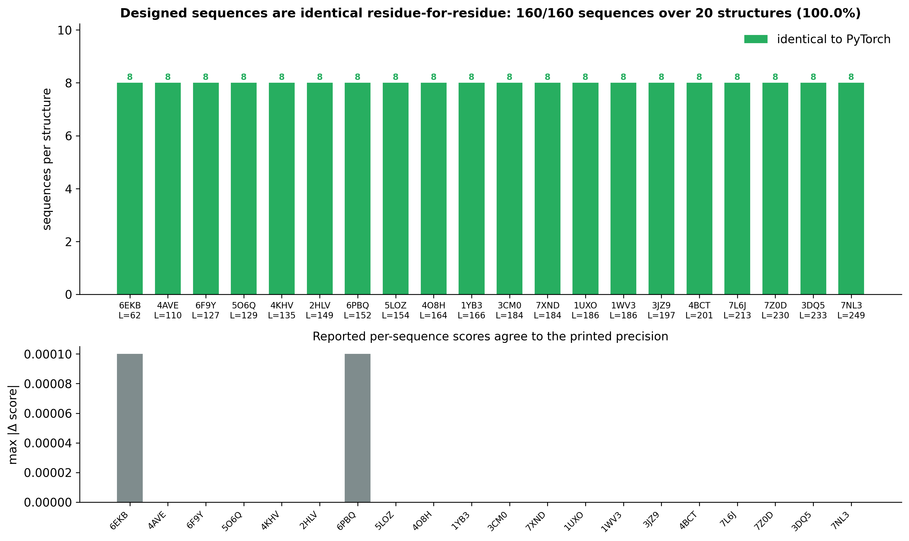
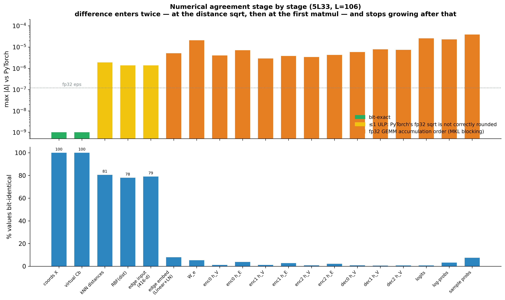

# ProteinMPNN — structure → sequence

**[Project page](https://github.com/lingxusb/folding-everywhere)** · **[Author](https://lingxusb.github.io)**

> This is the **ProteinMPNN** part of *Folding Everywhere v2*. It is one of the three models
> in the single app the repo ships — see the [top-level README](../README.md) and
> **[docs/GUI.md](../docs/GUI.md)**.
>
> ### **[Download the app](../dist/)** — `gui.exe` (Windows) · `gui` (macOS universal / Linux)
> Double-click it and open the **ProteinMPNN** tab. Nothing to download: all four
> checkpoints are compiled into the executable.

A from-scratch, dependency-free **Rust** reimplementation of
[ProteinMPNN](https://github.com/dauparas/ProteinMPNN) (Dauparas et al.,
*Science* 2022): give it a protein backbone, it designs amino-acid sequences for
it.

At the same seed it produces **the same sequences as the reference PyTorch
implementation, residue for residue** — verified against the unmodified upstream
code on 20 randomly drawn PDB structures.

```bash
mpnn --pdb backbone.pdb --num_seq_per_target 8 --sampling_temp 0.1 --seed 37
```

| | |
|---|---|
| Runtime dependencies | **none** — no Python, no PyTorch, no BLAS, no GPU |
| Model weights | **compiled into the executable** (all four vanilla checkpoints, ~27 MB) |
| Platforms | Windows x86-64, macOS universal (arm64 + Intel), Linux x86-64 |
| Interfaces | the **ProteinMPNN tab** of the shared `gui` app, and `mpnn` (CLI, drop-in for `protein_mpnn_run.py`) |
| Accuracy | 160/160 designed sequences identical to PyTorch across 20 random PDB structures |
| Speed / memory | ~level with default-threaded PyTorch on wall time; **6.6× less memory** |

---

## Quick start

Download the app for your platform from [`../dist/`](../dist/) and run it. There
is nothing else to install and nothing to download — the trained weights are
inside the binary.

**GUI** — double-click `gui` (`gui.exe` on Windows); it opens your browser. Pick the
**ProteinMPNN** tab, drop in a PDB (or click *Load example*) and press *Design sequences*.
The example is PDB 6EKB, one of the 20 benchmark structures — its native-sequence score
of `1.8975` in [`results/metrics.csv`](results/metrics.csv) is what the tab should show,
so the example doubles as a self-check.

**CLI** — `cargo build --release` at the repository root also produces `mpnn`.

**CLI**

```bash
# design 8 sequences for a backbone
./mpnn --pdb 5L33.pdb --num_seq_per_target 8 --sampling_temp 0.1 --seed 37

# only score the native sequence
./mpnn --pdb 5L33.pdb --score_only

# design chain A only, of a complex, at two temperatures
./mpnn --pdb complex.pdb --pdb_path_chains "A" --sampling_temp "0.1 0.3" --num_seq_per_target 4
```

Output is FASTA, in the same layout as the reference:

```
>5L33, score=1.5969, global_score=1.5969, fixed_chains=[], designed_chains=[A], model_name=v_48_020, seed=37
HMPEEEKAARLFIEALEKGDPELMRKVISPDTRMEDNGREFTGDEVVEYVKEIQKRGEQWHLRRYTKEGNSWRFEVQVDNNGQTEQWEVQIEVRNGRIKRVTITHV
>T=0.1, sample=1, score=0.8576, global_score=0.8576, seq_recovery=0.3868
SVDADTQKALDFVKALEEADPALMAKVITPDTEMTVNGKEYKGKEIVDFVKELAAKGVKYKLESYKKEGDEYVFTVTKSKDGKTYTITITIKVVDGKVKKVVIEEK
```

Lower `score` = the model is more confident in that sequence for that backbone.

### Options

```
--pdb FILE                 input backbone (required)
--model_name NAME          v_48_002 | v_48_010 | v_48_020 | v_48_030   (default v_48_020)
--num_seq_per_target N     sequences to sample                          (default 1)
--sampling_temp "T [T..]"  sampling temperature(s)                      (default 0.1)
--seed N                   RNG seed; matches torch.manual_seed          (default 37)
                           NOTE: 0 means "pick a random seed" (see below)
--pdb_path_chains "A B"    chains to design                             (default: all)
--omit_AAs STR             amino acids to forbid                        (default X)
--score_only               only score the native sequence
--out FILE                 write FASTA here                             (default: stdout)
--weights FILE             use an external .pt checkpoint (soluble / CA variants)
```

The model name encodes the backbone noise the checkpoint was trained with
(`v_48_020` = 48 neighbours, 0.20 Å). More noise → sequences more tolerant of an
imperfect backbone. `v_48_020` is the reference default.

### Seeds — read this if you want reproducible or matching output

`protein_mpnn_run.py` does `if args.seed:` and **0 is falsy in Python**, so
`--seed 0` there means *pick a random seed*, not *seed with zero*. That is its
default. This CLI matches the `--seed 0` behaviour but defaults to a fixed seed:

| | PyTorch `protein_mpnn_run.py` | Rust `mpnn` |
|---|---|---|
| no `--seed` | seed 0 → **random every run** | seed 37 → **reproducible** |
| `--seed 0` | random every run | random every run |
| `--seed N`, N ≠ 0 | reproducible | reproducible, **identical to PyTorch** |

So: **to compare the two, pass the same non-zero seed to both explicitly.**
Relying on defaults will give different (both valid) results, because PyTorch's
default is random. If you only want designs and don't care about
reproducibility, no seed is needed.

The differing default is deliberate — silently non-reproducible output is a poor
default for a design tool — but it *is* a user-visible divergence, so it is
stated here rather than left to be discovered.

---

## Does it really reproduce ProteinMPNN?

Yes, at the level that matters, and the repository proves it rather than
asserting it.

**Designed sequences are identical.** Same seed, same structure, same
temperature → the same residues. The benchmark drives *both public CLIs* and
diffs their FASTA output; see [`results/`](results/README.md).

| | |
|---|---|
| Structures | 20, drawn uniformly at random from the PDB (seed 20240804) |
| Chain lengths | 62 – 249 residues (3,411 total) |
| Sequences designed | 160 (8 per structure, T = 0.1, seed 37, model `v_48_020`) |
| **Sequences identical to PyTorch** | **160 / 160 (100%), residue for residue** |
| Plus a 32-configuration sweep | **150 / 150** across 4 checkpoints, T = 0.05–1.0, 4 seeds, complexes, homo-oligomer, fixed chains |
| Max \|Δ log P\| (full precision) | **4.1 × 10⁻⁵** |
| Cosine similarity of log-probabilities | **1.000000000000** |

<p align="center"></p>
<p align="center"><sub>Per-structure sequence identity between the Rust port and PyTorch — 8 designs each on 20 random PDB structures, every one identical residue for residue.</sub></p>

That holds across settings, not just one: the sweep covers all four checkpoints,
temperatures 0.05–1.0, four seeds, 16-sequence RNG streams, multi-chain
complexes, a homo-oligomer, and fixed-chain designs.

**Everything discrete is identical**: the k-nearest-neighbour graph (`E_idx`),
the random decoding order, the attention masks, and every random draw
(`torch.randn`, `exponential_`, `torch.multinomial`) — all bit-for-bit.

**Continuous values agree to fp32 round-off** (max |Δ log P| ~1e-5, cosine
similarity 1.0 to twelve decimals). They are not literally bit-identical, and
cannot be, for two reasons that belong to PyTorch rather than to this port:

1. PyTorch's fp32 `sqrt` is *not correctly rounded* — it lands 1 ULP below the
   IEEE result for ~0.6% of inputs (measured: 1116 of 200000 random values,
   always low). Every Cα–Cα distance goes through it.
2. fp32 GEMM accumulation order: PyTorch dispatches to MKL/oneDNN, whose blocked
   SIMD summation differs from any scalar fold.

Both are bounded and non-accumulating, which is why every downstream *decision*
still comes out the same. [`docs/CODE_STRUCTURE.md`](docs/CODE_STRUCTURE.md#3-numerics-what-is-bit-exact-and-what-is-not)
has the full breakdown, and this shows where the difference enters, layer by layer:

<p align="center"></p>
<p align="center"><sub>Stage-by-stage agreement: discrete outputs stay bit-identical the whole way through; the continuous values pick up fp32 round-off at the first GEMM and never accumulate beyond it.</sub></p>

### Speed, stated honestly

On a 4-core machine, designing 8 sequences for a 62–249 residue backbone:

| Comparison | Median |
|---|---|
| vs PyTorch pinned to 1 thread (per-core comparison) | Rust **1.61×** faster |
| vs PyTorch at its default thread count (what users get) | Rust **1.07×** faster |
| Peak memory | Rust **6.6×** lower (98 MB vs 643 MB) |

So: a from-scratch pure-Rust implementation lands roughly level with MKL-backed
PyTorch on wall time, and well ahead on memory and deployability. It is not
several times faster, and this README will not claim it is.

### Two things that were necessary to get right

*Seeding is not where you'd expect.* `protein_mpnn_run.py` seeds the RNG and
*then* builds the model — and building it initialises every parameter (Linear
kaiming/uniform, Embedding normal, plus an explicit `xavier_uniform_` sweep)
before `load_state_dict` throws all of it away. Those discarded draws still move
the generator, by exactly **3,305,317** for `v_48_020`. Reproducing `--seed N`
means advancing by the same amount; `model::torch_init_draws` derives the count
from the checkpoint itself.

*`--seed 0` does not mean "seed with zero".* `protein_mpnn_run.py` does
`if args.seed:`, and `0` is falsy in Python, so passing 0 makes it **pick a
random seed**. The Rust CLI matches that, which also means seed 0 is not
reproducible — use any non-zero seed if you want repeatable output.

*Multi-chain FASTA has its own rules.* The reference prints only the *designed*
chains, `/`-separated; weights `score` by `mask·chain_M·chain_M_pos` but
`global_score` by `mask` alone; and measures `seq_recovery` over designed
positions only. Getting any of these wrong makes the output look different even
when the network is right — the configuration sweep caught exactly that.

*`torch.randn` is not libm.* On CPU it fills a buffer with uniforms and then
Box-Muller-transforms them using the Cephes fp32 polynomials in
`ATen/native/cpu/avx_mathfun.h`, which PyTorch compiles with FMA contraction —
and it redraws the last 16 values when the length isn't a multiple of 16.
`rng.rs` reproduces all of that; `parity_rng.rs` pins 15,185 values across 70
(seed, size) cases as bit-exact.

---

## Repository layout

```
proteinmpnn/                    (this subtree)
├── mpnn/               the library + `mpnn` CLI
│   ├── src/            tensor, ops, pdb, featurize, features, layers, model, rng, weights
│   └── tests/          parity_ops, parity_rng, parity_model, pt_loader
├── python/             PyTorch reference harness + benchmark scripts
├── fixtures/           safetensors fixtures the Rust tests check against
├── weights/            the four vanilla checkpoints (embedded at build time)
├── results/            benchmark data, figures and writeup
└── docs/               CODE_STRUCTURE.md, DEPLOYMENT.md
```

The **GUI that drives this crate lives at [`../gui/`](../gui/)** and is shared with ESMFold
and RFdiffusion2; the prebuilt apps are in [`../dist/`](../dist/) and the workspace manifest
is [`../Cargo.toml`](../Cargo.toml).

`weights/` must stay exactly one directory above `mpnn/`: `mpnn/src/embedded.rs` reaches it
with `include_bytes!("../../weights/v_48_*.pt")`, and `mpnn/tests/` reach `fixtures/` with
`{CARGO_MANIFEST_DIR}/../fixtures`. That is why each model keeps its own subtree here rather
than sharing one flat `fixtures/` directory.

## Building from source

From the **repository root** (one Cargo workspace holds all three models plus the app):

```bash
cargo build --release --bin gui      # the app (all three models, one file)
cargo build --release                # also target/release/mpnn and the other CLIs
cargo test  --release -p proteinmpnn # the full parity suite
./build_all.sh                       # Windows + macOS + Linux distributables into ../dist/
```

Reproducing the validation needs the reference repo and a PyTorch install:

```bash
git clone https://github.com/dauparas/ProteinMPNN.git ../../ref_ProteinMPNN   # repo root
cd python
python gen_op_fixtures.py && python gen_rng_fixtures.py && python gen_weight_fixture.py
python ref_dump.py ../../ref_ProteinMPNN/inputs/PDB_monomers/pdbs/5L33.pdb 5L33 --seed 37
cd ../.. && cargo test --release -p proteinmpnn
```

`mpnn/tests/pt_loader.rs` and `mpnn/tests/parity_model.rs` look for the upstream repo at
`{CARGO_MANIFEST_DIR}/../../ref_ProteinMPNN` — i.e. **`ref_ProteinMPNN/` at the repository
root**, alongside `proteinmpnn/`. Clone it there and all 19 tests pass; without it those
eight skip-by-panic and the fixture-only ones (`parity_ops`, `parity_rng`) still pass, which
is enough to prove the crate is intact.

## Licence & credit

The model architecture and the trained weights are the work of Justas Dauparas
and co-authors; the upstream repository is MIT-licensed and the checkpoints are
redistributed here under those terms. This is an independent reimplementation of
the inference path — no training code, no new weights.

> Dauparas, J. et al. *Robust deep learning–based protein sequence design using
> ProteinMPNN.* Science 378, 49–56 (2022).
