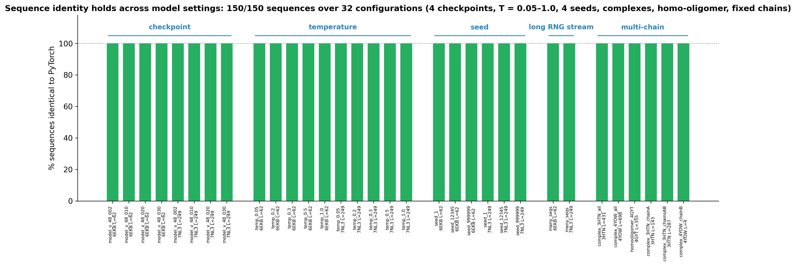
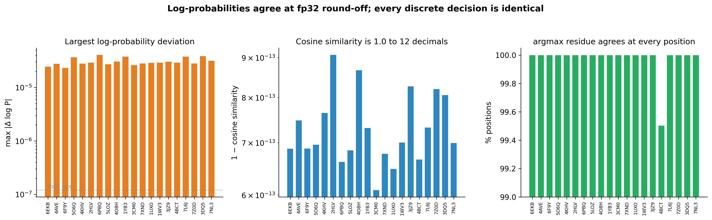
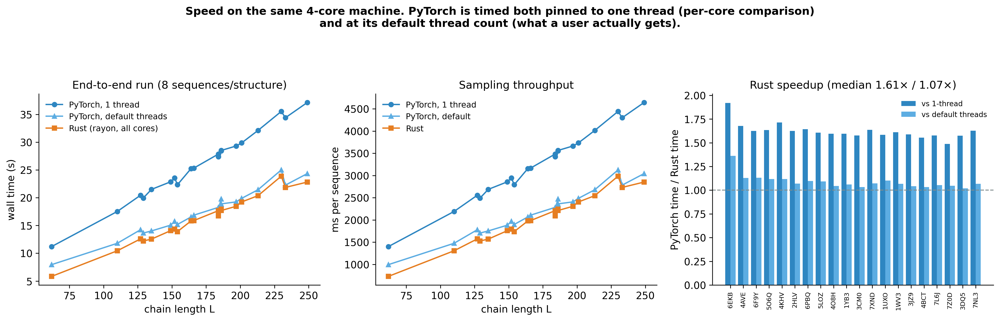
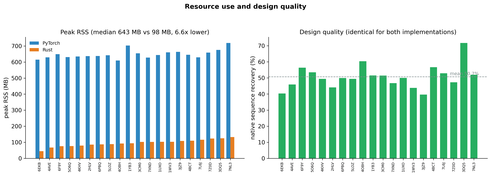

# Benchmark results — Rust vs PyTorch ProteinMPNN

Both implementations were driven through their **public CLIs**
(`protein_mpnn_run.py` and `mpnn`) at the same seed, on the same machine, and
their FASTA output was diffed. Nothing is shared between the two paths, so this
measures what a user would actually get.

## Headline

| | |
|---|---|
| Structures | 20, drawn uniformly at random from the PDB (seed 20240804), plus a 32-configuration sweep |
| Chain lengths | 62 – 249 residues (3,411 total) |
| Sequences designed | 160 (8 per structure, T = 0.1, seed 37, model `v_48_020`) |
| **Sequences identical to PyTorch** | **160 / 160 (100%), residue for residue** |
| Plus the configuration sweep | **150 / 150** across 4 checkpoints, T = 0.05–1.0, 4 seeds, complexes, homo-oligomer, fixed chains |
| Max \|Δ log P\| (full precision) | **4.1 × 10⁻⁵** |
| Cosine similarity of log-probabilities | **1.000000000000** |
| Peak memory | **6.6× lower** (median 98 MB vs 643 MB) |
| Wall time | **1.61×** faster than 1-thread PyTorch, **1.07×** vs default-threaded |

## Per-protein results

Times are for a complete CLI run: 8 sequences plus the native scoring pass,
including process start-up. `Δ log P` is the largest absolute difference over the
whole `[L, 21]` log-probability matrix.

| PDB | L | identical | max Δ log P | PyTorch 1-thr | PyTorch default | Rust | recovery |
|---|---:|:---:|---:|---:|---:|---:|---:|
| 6EKB | 62 | 8/8 | 2.5e-05 | 11.2 s | 8.0 s | 5.8 s | 40.3% |
| 4AVE | 110 | 8/8 | 2.8e-05 | 17.5 s | 11.8 s | 10.4 s | 45.9% |
| 6F9Y | 127 | 8/8 | 2.3e-05 | 20.4 s | 14.2 s | 12.6 s | 56.4% |
| 5O6Q | 129 | 8/8 | 3.7e-05 | 19.9 s | 13.6 s | 12.2 s | 53.5% |
| 4KHV | 135 | 8/8 | 2.8e-05 | 21.5 s | 14.0 s | 12.5 s | 49.4% |
| 2HLV | 149 | 8/8 | 2.9e-05 | 22.9 s | 15.1 s | 14.1 s | 44.1% |
| 6PBQ | 152 | 8/8 | 4.1e-05 | 23.6 s | 15.8 s | 14.4 s | 49.9% |
| 5LOZ | 154 | 8/8 | 2.7e-05 | 22.3 s | 15.2 s | 13.9 s | 49.4% |
| 4O8H | 164 | 8/8 | 3.1e-05 | 25.3 s | 16.5 s | 15.8 s | 60.4% |
| 1YB3 | 166 | 8/8 | 3.8e-05 | 25.3 s | 16.9 s | 15.9 s | 51.5% |
| 3CM0 | 184 | 8/8 | 2.6e-05 | 27.9 s | 18.3 s | 17.7 s | 51.5% |
| 7XND | 184 | 8/8 | 2.8e-05 | 27.4 s | 17.9 s | 16.7 s | 46.8% |
| 1UXO | 186 | 8/8 | 2.9e-05 | 28.4 s | 19.8 s | 18.0 s | 50.0% |
| 1WV3 | 186 | 8/8 | 2.9e-05 | 28.5 s | 18.9 s | 17.7 s | 43.8% |
| 3JZ9 | 197 | 8/8 | 3.0e-05 | 29.3 s | 19.3 s | 18.5 s | 39.7% |
| 4BCT | 201 | 8/8 | 2.9e-05 | 29.9 s | 19.9 s | 19.2 s | 56.7% |
| 7L6J | 213 | 8/8 | 3.8e-05 | 32.1 s | 21.4 s | 20.4 s | 52.9% |
| 7Z0D | 230 | 8/8 | 2.8e-05 | 35.5 s | 25.0 s | 23.9 s | 47.3% |
| 3DQ5 | 233 | 8/8 | 3.8e-05 | 34.4 s | 22.3 s | 21.9 s | 71.8% |
| 7NL3 | 249 | 8/8 | 3.1e-05 | 37.1 s | 24.3 s | 22.8 s | 52.0% |

`recovery` = fraction of the native sequence the model reproduces. It is a
property of ProteinMPNN, not of this port — both implementations give the same
value because they give the same sequences. The ~51% mean is in the expected
range for `v_48_020` at T = 0.1.

## Configuration sweep — does identity hold beyond one setting?

The table above pins a single configuration (`v_48_020`, T = 0.1, seed 37,
single-chain monomers). That is not enough to claim identical output in general,
so `sweep_configs.py` varies the axes a user would actually change and diffs the
two CLIs' FASTA at each point. Two of the twenty benchmark structures are used —
the shortest (6EKB, L = 62) and the longest (7NL3, L = 249) — since the axes
under test are the model settings, not the structure.

**32 configurations, 150 sequences, 150/150 identical.**

| Axis | Values | Result |
|---|---|---|
| Checkpoint | `v_48_002`, `v_48_010`, `v_48_020`, `v_48_030` | 32/32 sequences identical |
| Temperature | 0.05, 0.1, 0.2, 0.3, 0.5, 1.0 | 40/40 identical |
| Seed | 1, 2, 12345, 999999 | 32/32 identical |
| Long RNG stream | 16 sequences from one generator | 32/32 identical |
| Multi-chain complex | 3HTN (3 chains, L = 431), 4YOW (L = 698) | 8/8 identical |
| Homo-oligomer | 4GYT (L = 355) | 2/2 identical |
| Fixed chains | design A only / A+B of 3HTN; B of 4YOW | 12/12 identical |



Temperature matters most here: raising T flattens the probability vector, so the
multinomial draw becomes more sensitive to any perturbation of the
probabilities. Identity holds all the way to T = 1.0.

### What the sweep caught

Running it was worthwhile — the first pass failed 8 of 34 configurations, and
every failure was real:

- **Six multi-chain configurations** exposed four bugs in the Rust **CLI** (the
  network itself was already producing the right residues and scores):
  the `/` separators between designed chains were missing; fixed chains were
  printed when the reference omits them; `score` and `global_score` were emitted
  as the same number, where the reference weights `score` by
  `mask·chain_M·chain_M_pos` and `global_score` by `mask` alone; and
  `seq_recovery` was computed over all positions rather than designed ones.
  All four are fixed, and the multi-chain FASTA is now byte-identical to the
  reference.
- **Two `seed 0` configurations** were not a defect but a CLI semantic:
  `protein_mpnn_run.py` does `if args.seed:`, and `0` is falsy in Python, so
  `--seed 0` means *pick a random seed*. The Rust CLI now matches that, which
  also means seed 0 is not reproducible on either side and cannot be an identity
  test — hence its absence from the seed row above. Use any non-zero seed.

## What "identical" means here, precisely

| Quantity | Agreement |
|---|---|
| Designed sequences | **identical**, all 160, every residue |
| Featurization (X, S, mask, residue_idx, chain encoding) | bit-identical |
| Virtual Cβ | bit-identical |
| kNN neighbour indices `E_idx` | integer-identical |
| Decoding orders, attention masks | integer-identical |
| `torch.randn` / `exponential_` / `multinomial` draws | bit-identical |
| Checkpoint load (118 tensors, 1,660,485 params) | bit-identical |
| Reported per-sequence scores | agree to the 4 printed decimals (2 of 20 structures differ by 1 in the last digit) |
| log-probability matrices | max \|Δ\| 4.1e-5, cosine 1.0 to 12 decimals |
| Greedy argmax residue per position | 3,410 / 3,411 positions agree |

The single argmax disagreement (one position in 4BCT) is a genuine near-tie
between two amino acids whose log-probabilities differ by less than the fp32
noise floor. It does not affect any sampled sequence: sampling divides the
probabilities by exponential variates spanning orders of magnitude, so a 1e-5
perturbation cannot flip the winner.

### Why the continuous values are not bit-identical

Two reasons, both properties of PyTorch rather than of this port:

1. **PyTorch's fp32 `sqrt` is not correctly rounded.** Over 200,000 random
   inputs it returns 1 ULP *below* the IEEE result 1,116 times (0.56%) and never
   above. Every Cα–Cα distance passes through it, which is why
   `fig3_stage_parity.png` shows the difference appearing at "kNN distances",
   before any matrix multiply.
2. **fp32 GEMM accumulation order.** PyTorch dispatches to MKL/oneDNN, whose
   blocked-SIMD summation differs from any scalar fold. Matching it exactly would
   mean reimplementing MKL.

Neither error accumulates: `fig3_stage_parity.png` shows max |Δ| flat at ~1e-5
from the first matmul all the way to the sampled probabilities, twelve layers
later, with cosine similarity pinned at 1.0.

## Speed and memory

The speed comparison is reported two ways because they answer different
questions, and quoting only the first would flatter the Rust port:

- **vs PyTorch pinned to one thread** (the setting the reference harness uses for
  determinism, and the per-core comparison): Rust is **1.61×** faster.
- **vs PyTorch at its default thread count** (2 on this 4-core box — what a user
  actually gets): Rust is **1.07×** faster, i.e. roughly at parity.

Rust uses rayon across all cores in both comparisons. The honest summary is that
a from-scratch pure-Rust implementation lands about level with MKL-backed PyTorch
on wall time, while using **6.6× less memory** (median 98 MB vs 643 MB — the
PyTorch figure is dominated by importing torch itself) and needing no runtime
dependencies at all.

Machine: 4-core GCP VM (AVX-512), Linux 6.8, PyTorch 2.7.1+cpu, rustc 1.95.

## Figures

| | |
|---|---|
|  | **fig1** — every designed sequence matches, per structure |
|  | **fig2** — log-probability deviation, cosine similarity, argmax agreement |
|  | **fig3** — where numerical difference enters, stage by stage |
|  | **fig4** — wall time vs chain length, both PyTorch threadings |
|  | **fig5** — peak RSS, and native sequence recovery |
|  | **fig6** — sequence identity across the 32-configuration sweep |

## Files

```
results/
├── README.md               this writeup
├── proteins.json           the random draw: seed, pool size, chosen PDB ids
├── pdb/                    the 20 downloaded structures
├── metrics.csv             per protein: times, sequence agreement, scores, recovery
├── logprob_accuracy.csv    per protein: max |Δ log P|, cosine, argmax agreement
├── config_sweep.csv        per configuration: checkpoint/temperature/seed/chains, sequences identical
├── memory.csv              per protein: peak RSS of each implementation
├── stage_parity/*.json     per-stage statistics, written by the Rust parity tests
└── figures/                fig1 … fig5 (PNG, 300 dpi)
```

## Reproducing

```bash
cargo build --release
cd python
python select_proteins.py      # random draw + download (or reuse results/pdb)
python run_benchmark.py --num_seq 8 --temp 0.1 --seed 37
python compare_logprobs.py
python measure_memory.py
python sweep_configs.py        # the 32-configuration matrix
cd .. && cargo test --release  # regenerates results/stage_parity/
cd python && python make_figures.py
```

`select_proteins.py` is seeded, so the same 20 structures come back. The rest is
deterministic on any machine — the Rust side by construction, the PyTorch side
because the harness pins single-threaded fp32.
