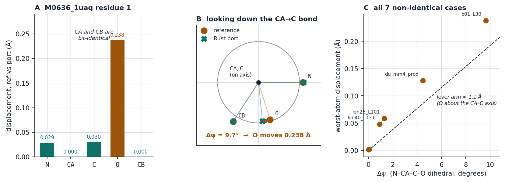

# Benchmark results — pure-Rust fp32 vs pinned PyTorch RFdiffusion2

**29 cases, measured 2026-08-11.** 10 proteins, designed lengths L = 30–230 tokens, five
configuration axes. Every number was produced by `bench/run_case.sh` and re-derived from the
saved `.pdb` files by `bench/compare2.py`; both are re-runnable without recomputing any design.

## Setup

| | |
|---|---|
| Reference | `RosettaCommons/RFdiffusion2` @ `d365cbf4db3958814a9f8e4f6f94fa309dfebc2b` (2026-04-03) |
| Weights | `RFD_173.pt`, 1 338 843 322 B, sha256 `590e126057f780afc1249d29545f0f90635562b1a3df5aff013afcfc39c3d3c3` |
| Reference env | torch 2.4.0+cpu (upstream's pin), numpy 1.26.4, scipy 1.13.1 |
| Machine | 4-core x86-64, 15 GB RAM, **no GPU**; everything CPU fp32 |
| Rust | 1.95.0, `--release` |

Reference conditions, all mandatory (see [`../docs/REPRODUCIBILITY.md`](../docs/REPRODUCIBILITY.md)):
`RFD2_PINNED=1`, `PYTORCH_JIT=0`, `PYTHONHASHSEED=1`, `OMP/MKL_NUM_THREADS=1`,
`MKL_CBWR=COMPATIBLE`.

## Headline

```
29 cases
  byte-identical output file      22  (76 %)
  ligand atoms bit-exact          29 / 29   (100 %)
  CONECT bond records exact       29 / 29   (100 %)
  speedup (Rust vs PyTorch)       mean 1.62x, range 1.28-2.15x
```

**Every residual is in the designed protein backbone.** Not one ligand coordinate and not one
bond record differed, in any case — including a 61-atom ligand, a 3-ligand system, and
single-atom metals (ZN, FE, MG).

## The seven cases that are not byte-identical

| case | L | protein atoms exact | max &#124;Δ&#124; | ligands | bonds |
|---|---|---|---|---|---|
| `du_mm4_prod` **production config** | 230 | 863/920 | **0.118 Å** | 50/50 | 53/53 |
| `p01_L30` | 30 | 105/109 | 0.192 Å | 9/9 | 8/8 |
| `len25_L101` | 101 | 247/261 | 0.042 Å | 50/50 | 53/53 |
| `len40_L131` | 131 | 402/411 | 0.033 Å | 50/50 | 53/53 |
| `du_T100_mid` | 49 | 105/108 | 0.002 Å | 28/28 | 29/29 |
| `p09_L82` | 82 | 101/105 | 0.001 Å | 61/61 | 64/64 |
| `cfg_T10s` | 49 | 104/108 | 0.001 Å | 28/28 | 29/29 |

Three of the seven differ by 0.001–0.002 Å, i.e. **one unit in the last printed decimal** —
the `%8.3f` PDB format resolves 5e-4 Å.

## Every residual is one carbonyl oxygen

The seven non-identical cases are not seven different problems. In **every one**, the
worst-displaced atom is a backbone **carbonyl O**, and that residue's CA is bit-identical:

| case | worst atom | displacement | Δψ (N–CA–C–O) | CA moved |
|---|---|---|---|---|
| `p01_L30` | res 1 **O** | 0.238 Å | −9.66° | 0.0000 Å |
| `du_mm4_prod` | res 102 **O** | 0.128 Å | 4.47° | 0.0000 Å |
| `len25_L101` | res 22 **O** | 0.059 Å | 1.29° | 0.0000 Å |
| `len40_L131` | res 63 **O** | 0.048 Å | 0.90° | 0.0010 Å |
| `du_T100_mid` | res 12 **O** | 0.002 Å | −0.02° | 0.0000 Å |
| `p09_L82` | res 14 **O** | 0.001 Å | −0.02° | 0.0000 Å |
| `cfg_T10s` | res 21 **O** | 0.001 Å | 0.03° | 0.0010 Å |



**Why the carbonyl O and nothing else.** N, CA, C and CB are placed directly by the residue's
rigid frame. O is the only backbone atom placed through the **ψ torsion**, i.e. rotated about
the CA–C bond after the frame is fixed. So it carries one extra degree of freedom that the
others do not, and it is the last atom placed in the backbone-building chain.

Panel A is the whole story for the worst case in the benchmark, `M0636_1uaq` residue 1: CA and
CB agree **to the last bit**, N and C move ~0.03 Å (a ~20 mrad frame rotation), and O moves
0.238 Å. Panel B looks down the CA→C bond — the rotation axis — where N and CB coincide exactly
and only O has swung. Panel C shows the displacement is simply `lever arm × Δψ` across all seven
cases, with the ~1.1 Å perpendicular distance from O to the CA–C axis as the slope.

So `M0636_1uaq` is not "a protein with a large error". It is **one carbonyl group rotated by
9.7°** at the N-terminus of a 21-residue design; 105 of its 109 protein atoms, all 9 ligand
atoms and all 8 bonds are exact. It is the largest residual in the panel only because it has
the largest Δψ — it sits at the far end of the same straight line as every other case.

**What is not yet established:** why Δψ reaches 9.7° when the ψ values are drawn from an RNG
that is verified bit-identical (generator after the psi draw: 32/32 identical), and a 20 mrad
frame difference alone accounts for only ~1.1°. The working hypothesis is ill-conditioned
normalisation — ψ enters as a 2-vector that is normalised, so when its magnitude happens to be
small a last-bit difference swings the angle a long way. That would also explain why the effect
is sporadic rather than length-dependent. The test is to dump the ψ pair's magnitude for these
residues and check it is near zero on exactly the large-Δψ cases; it has not been run. **Stated
as a hypothesis, not a finding.**

## Read this before reading byte-identity as a pass/fail

Byte-identity held on 22 of 29 cases but **does not survive to production scale**. The realistic
configuration — 4 catalytic residues, 180 designed residues — agrees to 0.118 Å with 93.8 % of
atoms bit-identical. That is the accumulation of occasional 1-ULP rounding ties over a longer
chain, not a systematic divergence: the port and the reference each carry their own last-bit
errors, and neither is correctly rounded everywhere
([`../docs/REPRODUCIBILITY.md`](../docs/REPRODUCIBILITY.md) §1, "Agreement is NOT monotone in
the port's correctness").

For scale: 0.118 Å is far below any structural significance (bond lengths ~1.5 Å, experimental
resolution 1–2 Å) and vastly below RFdiffusion2's own inference noise — the model runs **with
dropout live**, ~2.64 M draws per forward, so changing the seed changes the design completely.

## By configuration axis

| axis | cases | result |
|---|---|---|
| 10 proteins, L = 30–117, T=2 | 10 | 8 byte-identical; residuals 0.001 and 0.192 Å |
| designed length, L = 39–131 | 5 | 3 byte-identical; 0.042 / 0.033 Å at L ≥ 101 |
| `T` = 2 / 10 / 100 | 6 | 4 byte-identical; two at 0.001–0.002 Å |
| self-conditioning | 2 | **both byte-identical** |
| variable-length contigs | 2 | **both byte-identical** |
| `num_designs = 2` | 2 (×2 designs) | **all four byte-identical** — the per-design reseed is exact |
| multi-motif contigs | 2 | 1 byte-identical (L=82); production L=230 at 0.118 Å |

Residual magnitude does **not** grow with length (L=101 → 0.042 Å, L=131 → 0.033 Å): more
designed residues means more chances for a tie to fire, not a larger error when one does.

## T = 100, the demo's real setting — byte-identical

```
reference sha256 4983a0689b7ca7b0f6c023e2264ccc60f67c05ccd0a655513cd0970b3004b07b
port      sha256 4983a0689b7ca7b0f6c023e2264ccc60f67c05ccd0a655513cd0970b3004b07b
267/267 lines · ATOM 111/111 · HETATM 50/50 · CONECT 106/106
reference 8475.9 s   port 5763.3 s   (port 1.47x faster)
```

## Component parity — 17 tests, all passing

Rungs 1–3, the op- and RNG-level gates underneath the end-to-end result
(`rung_1_3_measured.txt` is the raw capture):

```
relu: 6009 values bit-identical
elu: 6009 values, 5944 bit-identical, 65 within 1 ULP of exp (max |Δ| 5.9604645e-8 at x=-2.9799998e0)
embedding emb_80x256: 38400 values exact
embedding emb_83x64: 9600 values exact
embedding emb_164x256: 38400 values exact
layer_norm: worst max|Δ| 1.907e-6
softmax: worst max|Δ| 8.941e-7
linear: 45 cases, worst max|Δ| 2.146e-6 at lin_114x64_r150
numpy normal: 37110 values bit-identical
scipy Rotation.random: 9450 f64 values bit-identical
torch randn/rand: 74052 values bit-identical
pt reader exposes 14419 names: 7208 EMA, 7208 final
EMA vs final: 570/7208 tensors bit-identical
pt loader: 7208/7208 tensors, 82911693 parameters bit-identical to torch.load
```

Rungs 4–7 are in `rung_4e_7_endtoend.txt`. `layerwise_M0584_1ldm.tsv` carries the
layer-by-layer record for one protein — 579 rows from PDB parse to written `.pdb`, with
standalone and cumulative columns.

**Fixture staleness is the failure mode to watch.** A fixture older than the last change to
`python/pinned.py` *or* to the noiser silently measures the wrong target — the tests still
pass. Check the mtimes before believing a rung:

```bash
stat -c '%y  %n' python/pinned.py fixtures/*/*.safetensors | sort
```

## Performance

Mean **1.62x faster than pinned PyTorch**, range 1.28–2.15x, over 23 timed cases. At the
production config: 26.0 min (PyTorch) vs 18.4 min (Rust). Runtime scales as roughly L^1.8 on
both sides.

**The advantage narrows as L grows** — 2.15x at L=30, ~1.7x at L=50, ~1.5x at L=80–130, and
1.41x at L=230 (fig2, right panel). At small L the port wins on per-op overhead; at large L the
GEMM dominates and MKL is the harder baseline, so the curve flattens toward the ratio of the two
matmul implementations. Anyone extrapolating to production-size designs should use the ~1.4x
figure, not the mean.

Two rows are excluded from timing figures and stated here rather than hidden: `p07_L69` (a retry
— its reference had already run, so the timer caught a partial re-execution) and `cfg_varlen_s`
(ran under batch contention; the only sub-1x row). Both are included in every parity number.

## Method, and two hazards it had to close

Each case runs **reference first**, dumps that run's own `rfi`, builds the ligand sidecar from
it, then runs the port. Two things make that ordering mandatory:

* **`atom_frames` cannot be recomputed.** `get_atom_frames` breaks priority ties by CPython
  set-iteration order; on M0584 20 of 50 atoms tie and recomputation disagreed on 1.
  `gen_ligand_bonds.py` previously hardcoded M0584's dump path, which for any other protein was
  either shape-rejected or — had atom counts coincided — **silently wrong**. It is now per-case
  (`RFD2_ATOM_FRAMES`).
* **Ligand block order is a hash artifact, not a result.** `idealize_backbone.rewrite` recovers
  the ligand list from a Python `set`, so the HETATM order in the reference's own output follows
  CPython string hashing. For `{NAD,OXM}` that happens to be input order; for `{ZN,DUC}` it is
  not. Comparing positionally reported a 3.26 Å "error" for ligand atoms that are in fact
  bit-identical. `compare2.py` therefore matches ligand atoms on (residue name, atom name) and
  CONECT as a **set** of bonds mapped through each file's own atom table.

## Figures

`figures/` — `fig1` agreement per protein, `fig2` runtime and speedup vs L, `fig3` length
scaling, `fig4` agreement by configuration, `fig5` daily-use configurations, `fig6` the carbonyl
oxygen analysis.

## Files

| File | What's inside |
|---|---|
| `benchmark_results.tsv` | the 29 cases, one row each — parity, residuals, timings |
| `benchmark_raw.tsv` | the raw per-case capture behind it |
| `layerwise_M0584_1ldm.tsv` | 579-row layer-by-layer record for `M0584_1ldm` |
| `rung_1_3_measured.txt` · `rung_1_4_measured.txt` | op- and RNG-level parity captures |
| `rung_4e_7_endtoend.txt` | rungs 4e–7, the end-to-end gate |
| `stage0_correctly_rounded.txt` | the double-double `exact` feature check |
| `forward_probe.txt` · `ligand_bond_probe.txt` · `phaseB_dump_comparison.txt` | probe captures |
| `figures/` | fig1 … fig6 (PNG) |

## Reproducing

```bash
cd bench
./run_case.sh <case>          # one case, reference then port
python compare2.py            # re-derive every number from the saved .pdb files
python make_figures.py        # writes results/figures/*.png
```

The end-to-end gate on its own, PDB in / PDB out:

```bash
export PYTHONPATH=../ref_RFdiffusion2 RFD2_REF=../ref_RFdiffusion2
REF=$PWD/../ref_RFdiffusion2 SCR=/tmp/rfd2gate
mkdir -p $SCR/ref $SCR/rs

# The reference. PYTHONHASHSEED is NOT optional: `idealize_backbone.rewrite`
# recovers the ligand list from a Python `set`, so the HETATM block's order
# follows the interpreter's hash seed rather than `inference.deterministic`.
PYTHONHASHSEED=1 PYTORCH_JIT=0 RFD2_PINNED=1 .venv/bin/python python/run_reference.py \
  --config-name=aa \
  inference.ckpt_path=$REF/rf_diffusion/model_weights/RFD_173.pt \
  inference.input_pdb=$REF/rf_diffusion/benchmark/input/mcsa_41/M0584_1ldm.pdb \
  "inference.ligand='NAD,OXM'" "contigmap.contigs=['10,A106-106,10']" \
  inference.contig_as_guidepost=False inference.num_designs=1 \
  inference.deterministic=True inference.idealize_sidechain_outputs=False \
  inference.write_trb_indep=False diffuser.T=2 \
  inference.output_prefix=$SCR/ref/design

# The port.
cargo run --release --bin rfd2 -- \
  --input-pdb $REF/rf_diffusion/benchmark/input/mcsa_41/M0584_1ldm.pdb \
  --contigs '10,A106-106,10' --ligand NAD,OXM \
  --ligand-topology fixtures/ligand/M0584_1ldm.safetensors \
  --weights fixtures/weights/model_state_dict.safetensors \
  --igso3 fixtures/noiser/stages.safetensors \
  --T 2 --output-prefix $SCR/rs/design

diff $SCR/ref/design_0-atomized-bb-False.pdb $SCR/rs/design_0-atomized-bb-False.pdb
```
